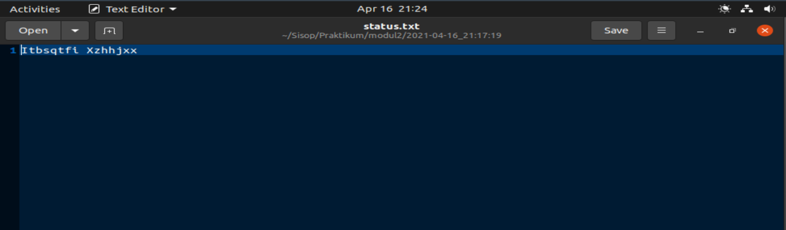

# soal-shift-sisop-modul-2-F05-2021
## soal1
### Soal 1A
Soal ini diminta untuk membuat folder baru sesuai dengan keinginan steven,
yaitu dengan nama Musyik untuk mp3, Fylm untuk mp4, dan Pyoto untuk jpg.<br><br>

Berikut merupakan fungsi untuk membuat folder / directory baru:
```
child1 = fork();
    if (child1 < 0)
        exit(0);
    if (child1 == 0)
    {
        char *argv[] = {"mkdir", "-p", pathmusik, NULL};
        execv("/bin/mkdir", argv);
    }
    child2 = fork();
    if (child2 < 0)
        exit(0);
    if (child2 == 0)
    {
        char *argv[] = {"mkdir", "-p", pathfoto, NULL};
        execv("/bin/mkdir", argv);
    }
    child3 = fork();
    if (child3 < 0)
        exit(0);
    if (child3 == 0)
    {
        char *argv[] = {"mkdir", "-p", pathfilm, NULL};
        execv("/bin/mkdir", argv);
    }
```

`child1 = fork();`, `child2 = fork();`, dan `child3 = fork();` digunakan untuk membuat proses baru pada pembuatan directory yang bernama Musyik, Pyoto,
dan Fylm. Pada proses `execv("/bin/mkdir", argv)` akan digunakan untuk menjalankan proses mkdir yang dimana mengarah pada proses membuat sebuah direktori baru.

### Soal 1B
Soal ini diminta untuk mendownload / mengunduh file zip yang tertera pada link yang diberikan.<br><br>

Proses ini dapat dilakukan sebagai berikut : 

```
while (wait(&status) > 0)
    ;
    child4 = fork();
    if (child4 < 0)
        exit(0);
    if (child4 == 0)
	{
        printf("sudah didownload\n");
        char *arg[] = {"wget", "--no-check-certificate", linkmusik, "-O", "Musik_for_Stevany.zip", "-o", "/dev/null", NULL};
        execv("/usr/bin/wget", arg);
    }
    while (wait(&status1) > 0)
        ;
    child5 = fork();
    if (child5 < 0)
        exit(0);
    if (child5 == 0)
    {
        printf("sudah didownload\n");
        char *arg[] = {"wget", "--no-check-certificate", linkfoto, "-O", "Foto_for_Stevany.zip", "-o", "/dev/null", NULL};
        execv("/usr/bin/wget", arg);
    }
    while (wait(&status2) > 0)
        ;
    child6 = fork();
    if (child5 < 0)
        exit(0);
    if (child6 == 0)
    {
        printf("sudah didownload\n");
        char *arg[] = {"wget", "--no-check-certificate", linkfilm, "-O", "Film_for_Stevany.zip", "-o", "/dev/null", NULL};
        execv("/usr/bin/wget", arg);
    }
```
Dilakukannya perulangan `while (wait(&status) > 0)` yang menandakan bahwa adanya proses untuk menunggu dari
proses yang dijalankan sebelumnya itu sudah selesai atau belum. `"/usr/bin/wget";` digunakan untuk menjalankan 
perintah `wget` yang dimana perintah tersebut mengarah pada proses mendownload file zip dari setiap link yang 
diberikan.<br><br> 

### Soal 1C
Soal ini diminta untuk menunzip atau menekstract file-file zip yang sudah didownload sebelumnya.<br><br>

Untuk proses ini dapat dilakukan sebagai berikut:
```
while (wait(&status3) > 0)
    ;
    child7 = fork();
    if (child7 < 0)
        exit(0);
    if (child7 == 0)
    {
        char *arg[] = {"unzip", "-o", "-q", "./Musik_for_Stevany.zip", NULL};
        execv("/usr/bin/unzip", arg);
    }
    while (wait(&status4) > 0)
        ;
    child8 = fork();
    if (child8 < 0)
	    exit(0);
    if (child8 == 0)
    {
        char *arg[] = {"unzip", "-o", "-q", "./Foto_for_Stevany.zip", NULL};
        execv("/usr/bin/unzip", arg);
    }
    while (wait(&status5) > 0)
        ;
    child9 = fork();
    if (child9 < 0)
        exit(0);
    if (child9 == 0)
    {
        char *arg[] = {"unzip", "-o", "-q", "./Film_for_Stevany.zip", NULL};
        execv("/usr/bin/unzip", arg);
    }
```
Pada setiap proses ini terdapat juga proses perulangan `wait(&status...) > 0` yang dimana untuk menunggu
dari proses yang dijalankan sebelumnya itu sudah selesai atau belum. `"/usr/bin/unzip"` digunakan untuk menjalankan 
perintah `unzip` yang dimana perintah tersebut mengarah pada proses menekstract keseluruhan file-file zip yang sudah
diunduh sebelumnya.<br><br>   

### Soal 1D
Soal ini diminta untuk memindahkan semua file yang berada di folder zip yang sudah di ekstract sebelumnya
ke folder baru yang sudah dibuat.<br><br>

Proses ini dapat dilakukan sebagai berikut : 
```
while (wait(&status6) > 0)
    ;
    child10 = fork();
    if (child10 < 0)
        exit(0);
    if (child10 == 0)
    {
        char *argv[] = {"find", "./MUSIK", "-mindepth", "1", "-type", "f", "-exec", "mv",
                        "-t", "./Musyik", "{}", "+", NULL};
        execv("/usr/bin/find", argv);
    }
    while (wait(&status7) > 0)
        ;
    child11 = fork();
    if (child11 < 0)
        exit(0);
    if (child11 == 0)
    {
        char *argv[] = {"find", "./FOTO", "-mindepth", "1", "-type", "f", "-exec", "mv",
                        "-t", "./Pyoto", "{}", "+", NULL};
        execv("/usr/bin/find", argv);
    }
    while (wait(&status8) > 0)
        ;
    child12 = fork();
    if (child12 < 0)
        exit(0);
    if (child12 == 0)
    {
        char *argv[] = {"find", "./FILM", "-mindepth", "1", "-type", "f", "-exec", "mv",
                        "-t", "./Fylm", "{}", "+", NULL};
        execv("/usr/bin/find", argv);
    }
    //Hapus File
    while (wait(&status9) > 0)
        ;
    child13 = fork();
    if (child13 < 0)
        exit(0);
    if (child13 == 0)
    {
        char *argv[] = {"rm", "-r", "Musik_for_Stevany.zip", "Foto_for_Stevany.zip", "Film_for_Stevany.zip", NULL};
        execv("/bin/rm", argv);
    }
    while (wait(&status10) > 0)
        ;
    exit(0);
    }
```

`/usr/bin/find` untuk mencari pada `/home/raharja/modul2-1/MUSIK`, `/home/raharja/modul2-1/FILM`, dan juga
`/home/raharja/modul2-1/FOTO`. `"-mindepth", "1"` untuk menandakan bahwa yang dicari adalah semua yang ber `type` 
directory (`"f"`). Lalu dilakukan pemindahan semua file tersebut dengan `"mv -t ./Fylm {} +"`. `/bin/rm` untuk
menghapus semua file zip yang sudah sudah di ekstract sebelumnya pada `"/home/raharja/modul2-1/Musik_for_Stevany.zip", 
/home/raharja/modul2-1/"Foto_for_Stevany.zip", /home/raharja/modul2-1/"Film_for_Stevany.zip"` dengan `"rm -r"`.<br><br>

### Soal 1E
Soal ini diminta untuk semua proses yang dijalankan sebelumnya tersebut berjalan otomatis 6 jam sebelum 
waktu ulang tahun Stevany.<br><br>

Soal ini dikerjakan dengan mengimplementasikan materi *Daemon Process* 
yang sudah diajarkan pada modul2. Berikut bentuk implementasinya :

```
if (t->tm_mon == 3 && t->tm_mday == 9 && t->tm_hour == 16 && t->tm_min == 22 && t->tm_sec == 0)
{
    child = fork();
    if (child < 0)
        exit(0);
}
```
Proses ini dilakukan pengecekan `(t->tm_mon == 3 && t->tm_mday == 9 && t->tm_hour == 16 && t->tm_min == 22 && t->tm_sec == 0)`, apakah semua proses
tersebut tadi berjalan otomatis 6 jam sebelum ulang waktu ulang tahun stevany tersebut dimulai.

### Soal 1F
Untuk soal ini diminta pada waktu ulang tahunnya Stevany, untuk semua folder di zip dengan nama Lopyu_Stevany.zip dan 
semua folder akan di delete(sehingga hanya menyisakan .zip).<br><br>

Soal ini sama seperti soal 1E, yaitu dikerjakan dengan mengimplementasikan materi *Daemon Process* 
yang sudah diajarkan pada modul2. Berikut bentuk implementasinya :

```
else if (t->tm_mon == 3 && t->tm_mday == 9 && t->tm_hour == 22 && t->tm_min == 22 && t->tm_sec == 0)
{
    child14 = fork();
    if (child14 == 0)
    {
        child15 = fork();
        if (child15 < 0)
            exit(0);
        if (child15 == 0)
        {
            char *arg[] = {"zip", "-q", "-rm", "Lopyu_Stevany.zip", "./Musyik", "./Fylm", "./Pyoto", NULL};
            execv("/usr/bin/zip", arg);
        }
        while (wait(&status11) > 0)
            ;
        child16 = fork();
        if (child16 < 0)
            exit(0);
        if (child16 == 0)
        {
            char *arg[] = {"rm", "-r", "./MUSIK", "./FILM", "./FOTO", NULL};
            execv("/bin/rm", arg);
        }
        while (wait(&status11) > 0)
            ;
        exit(0);
        }
    }
    
    while (wait(&status12) > 0)
        ;
    sleep(1);
}

```
Pada proses ini dilakukan pengecekan kembali `(t->tm_mon == 3 && t->tm_mday == 9 && t->tm_hour == 22 && t->tm_min == 22 && t->tm_sec == 0)`,
apakah proses tersebut tadi berjalan saat waktu ulang tahun stevany dimulai. jika benar, maka dilakukan proses yaitu menzip `("/usr/bin/zip")`semua file yang ada
folder `"./Musyik", "./Fylm", "./Pyoto"` dengan nama "Lopyu_Stevany.zip". `"/bin/rm"` digunakan untuk menjalankan proses rm yang dimana mengarah pada proses
penghapusan semua folder `("./MUSIK", "./FILM", "./FOTO")` pada `/home/raharja/modul2-1` dengan `"rm -r"`.

## soal2
### Soal 2A
Pada soal 2a diminta untuk meng-extract file zip yang diberikan yaitu *pets.zip* ke folder `/petshop`dapat dilakukan pada proses berikut
```
child = fork();
  if (child == 0)
  {
    char *argv[] = {"unzip", "/home/juned/modul2/pets.zip", "-d",
                    "/home/juned/modul2/petshop", NULL};
    execv("/usr/bin/unzip", argv);
  }
```
Dan setelah itu diminta untuk menghapus folder yang tidak penting, hal tersebut dapat dilakukan dengan proses berikut
```
 while ((waitpid(child, &status, 0)) > 0)
    ;
  child1 = fork();
  if (child1 == 0)
  {
    char *argv[] = {"find", "/home/juned/modul2/petshop", "-mindepth", "1", "-type", "d", "-exec", "rm",
                    "-r", "{}", "+", NULL};
    execv("/usr/bin/find", argv);
  }
```
`/usr/bin/find` untuk mencari pada `/home/juned/modul2/petshop`,  `"-mindepth", "1"` untuk menandakan bahwa yang dicari adalah semua yang ber `type` directory (`"d"`). Lalu dilakukan remove/hapus semua file tersebut dengan `rm -r {} +`
### Soal 2B
Pada soal2b diminta untuk membuat folder sesuai jenis peliharaan seperti `/petshop/cat` untuk jenis kucing.
Agar lebih memudahkan, perlu diperiksa nama dari setiap file terlebih dahulu dengan proses berikut
```
child2 = fork();
  if (child2 == 0)
  {
    DIR *dp;
    struct dirent *ep;
    char path[] = {"/home/juned/modul2/petshop"};

    dp = opendir(path);

    if (dp != NULL)
    {
      while ((ep = readdir(dp)))
      {
        //puts(ep->d_name);

        char str[100];

        char new[100];
        memset(str, 0, sizeof(str));
        memset(new, 0, sizeof(new));
        strcpy(str, ep->d_name);

        if (ep->d_name[0] != '.')
        {
          int i = 0;

          while (str[i] != ';')
          {
            new[i] = str[i];
            i++;
            if (str[i] == ';')
            {
              break;
            }
          }
          i = 0;
          char lokasi[100] = {"/home/juned/modul2/petshop/"};
          char file[100] = {"/home/juned/modul2/petshop/"};

          strcat(lokasi, new);
          strcat(file, ep->d_name);
          if (strchr(str, '_') != NULL)
          {

            char file[100];
            strcpy(file, str);
            char *file2 = strtok(file, "_");
            file2 = strtok(NULL, "_");
            char fol2[100];
            strcpy(fol2, file2);
            char *folder2 = strtok(fol2, ";");

            char src[100] = {"/home/raharja/modul2/petshop/"};
            char src2[100] = {"/home/juned/modul2/petshop/"};
            char dest[100] = {"/home/juned/modul2/petshop/"};
            strcat(src, str);
            strcat(dest, file2);
            strcat(src2, folder2);
            copy(src, dest, src2, file2);
          }
          pindah(lokasi, file, ep->d_name);
        }
      }
```
Perlu dilakukan pengecekan apakah file berisi 1 atau 2 peliaharan yang ditandai dengan adanya `"_"`.Maka dilakukan pengecekan dengan `strchr(str, '_')`.Sehingga ketika nama filenya tidak mengandung `"_"`nama folder yang akan dibuat akan tersimpan pada variabel `lokasi` dan akan langsung dipindahkan dengan fungsi `(lokasi, file, ep->d_name)`. Namun, ketika nama file terdapat `"_"` maka file akan diduplikat terlebih dahulu lalu dipindahkan.
berikut adalah fungsi `pindah`
```
void pindah(char *lokasi, char *file, char *nama)
{
  int status;

  pid_t child2 = fork();
  if (child2 == 0)
  {
    char *argv[] = {"mkdir", "-p", lokasi, NULL};
    execv("/bin/mkdir", argv);
  }
  while ((waitpid(child2, &status, 0)) > 0)
    ;
  pid_t child3 = fork();

  if (child3 == 0)
  {
    char nick[100];
    char petname[100];
    char umur[100];
    char ket[100];

    strcpy(nick, nama);
    char delim[] = ";";
    char *ptr = strtok(nick, delim);
    int id = 1;

    while (ptr != NULL)
    {
      if (id == 2)
      {
        sprintf(petname, "%s", ptr);
      }
      if (id == 3)
      {
        sprintf(umur, "%s", ptr);
        strtok(umur, "_");
        strtok(umur, "j");
        if (umur[strlen(umur) - 1] == '.')
        {
          umur[strlen(umur) - 1] = '\0';
        }
      }
      ptr = strtok(NULL, delim);
      id++;
    }

    char loc[100];
    strcpy(ket, lokasi);
    strcpy(loc, lokasi);
    strcat(loc, "/");
    strcat(loc, petname);
    strcat(loc, ".jpg");

    FILE *fptr;
    char st[100];
    char fname[50];
    strcpy(fname, lokasi);
    strcat(fname, "/keterangan.txt");
    fptr = fopen(fname, "a+");

    fprintf(fptr, "nama : %s\n", petname);
    fprintf(fptr, "umur : %s tahun\n\n", umur);

    fclose(fptr);

    char *argv[] = {"mv", file, loc, NULL};
    execv("/bin/mv", argv);
  }
}
```
berikut adalah fungsi `copy`
```
void copy(char *src, char *dest, char *lokasi, char *nama)
{
  int status;
  pid_t child = fork();
  if (child == 0)
  {
    char *argv[] = {"cp", src, dest, NULL};
    execv("/bin/cp", argv);
  }
  // copy(src, dest, src2, file2);
  //pindah(src2, dest, file2);
  //void pindah(char *lokasi, char *file, char *nama)
  while ((waitpid(child, &status, 0)) > 0)
    ;
  pid_t child2 = fork();
  if (child2 == 0)
  {
    char *argv[] = {"mkdir", "-p", lokasi, NULL};
    execv("/bin/mkdir", argv);
  }
  while ((waitpid(child2, &status, 0)) > 0)
    ;
  pid_t child3 = fork();

  if (child3 == 0)
  {
    char nick[100];
    char petname[100];
    char umur[100];
    char ket[100];

    strcpy(nick, nama);
    char delim[] = ";";
    char *ptr = strtok(nick, delim);
    int id = 1;

    while (ptr != NULL)
    {
      if (id == 2)
      {
        sprintf(petname, "%s", ptr);
      }
      if (id == 3)
      {
        sprintf(umur, "%s", ptr);
        strtok(umur, "_");
        strtok(umur, "j");
        if (umur[strlen(umur) - 1] == '.')
        {
          umur[strlen(umur) - 1] = '\0';
        }
      }
      ptr = strtok(NULL, delim);
      id++;
    }

    char loc[100];
    strcpy(ket, lokasi);
    strcpy(loc, lokasi);
    strcat(loc, "/");
    strcat(loc, petname);
    strcat(loc, ".jpg");

    FILE *fptr;
    char st[100];
    char fname[50];
    strcpy(fname, lokasi);
    strcat(fname, "/keterangan.txt");
    fptr = fopen(fname, "a+");

    fprintf(fptr, "nama : %s\n", petname);
    fprintf(fptr, "umur : %s tahun\n\n", umur);

    fclose(fptr);

    char *argv[] = {"mv", dest, loc, NULL};
    execv("/bin/mv", argv);
  }
}
```
Untuk membuat file dapat dilakukan dengan proses yang ada pada fungsi `pindah` dan `copy` berikut 
```
 pid_t child2 = fork();
  if (child2 == 0)
  {
    char *argv[] = {"mkdir", "-p", lokasi, NULL};
    execv("/bin/mkdir", argv);
  }
```
### Soal 2C
Pada soal 2c, diminta untuk memindahkan file sesuai dengan jenisnya dan direname sesuai namanya. Hal tersebut dapat dilakukan dengan proses berikut
```
 if (child3 == 0)
  {
    char nick[100];
    char petname[100];
    char umur[100];
    char ket[100];

    strcpy(nick, nama);
    char delim[] = ";";
    char *ptr = strtok(nick, delim);
    int id = 1;

    while (ptr != NULL)
    {
      if (id == 2)
      {
        sprintf(petname, "%s", ptr);
      }
      if (id == 3)
      {
        sprintf(umur, "%s", ptr);
        strtok(umur, "_");
        strtok(umur, "j");
        if (umur[strlen(umur) - 1] == '.')
        {
          umur[strlen(umur) - 1] = '\0';
        }
      }
      ptr = strtok(NULL, delim);
      id++;
    }
    //ini untuk 3e
    char loc[100];
    strcpy(ket, lokasi);
    strcpy(loc, lokasi);
    strcat(loc, "/");
    strcat(loc, petname);
    strcat(loc, ".jpg");

    FILE *fptr;
    char st[100];
    char fname[50];
    strcpy(fname, lokasi);
    strcat(fname, "/keterangan.txt");
    fptr = fopen(fname, "a+");
    //3e sampai disini
    fprintf(fptr, "nama : %s\n", petname);
    fprintf(fptr, "umur : %s tahun\n\n", umur);

    fclose(fptr);

    char *argv[] = {"mv", file, loc, NULL};
    execv("/bin/mv", argv);
  }
```
Untuk mendapatkan nama dari perliharaan dapat dilakukan dengan
```
  strcpy(nick, nama);
    char delim[] = ";";
    char *ptr = strtok(nick, delim);
    int id = 1;

    while (ptr != NULL)
    {
      if (id == 2)
      {
        sprintf(petname, "%s", ptr);
      }
      if (id == 3)
      {
        sprintf(umur, "%s", ptr);
        strtok(umur, "_");
        strtok(umur, "j");
        if (umur[strlen(umur) - 1] == '.')
        {
          umur[strlen(umur) - 1] = '\0';
        }
      }
      ptr = strtok(NULL, delim);
      id++;
    }
```
variabel `nama` pada awalnya akan berisi nama awal seperti `cat;joni;6.jpg`(karena fungsi *pindah* hanya untuk 1 peliharan). Lalu dilakukan pemotongan string dengan `strtok(string,delimiter)`. Hingga diperoleh nama dan umurnya. Lalu diganti nama file lama dengan nama yang didapat dengan
```
 char *argv[] = {"mv", file, loc, NULL};
    execv("/bin/mv", argv);
```
### Soal 2D
Diminta untuk memisahkan file yang terdapat lebih dari 1 peliharaan lalu memindahkan dan mengganti namanya sesuai ketentuan pada setiap folder.
Karena pada **Soal 2B** dapat diperoleh file dengan lebih dari 1 peliharaan, perlu dilakukan duplikasi dengan fungsi `copy` seperti yang telah dibuat.
Fungsi ini mirip seperti fungsi pindah tetapi di awal terdapat proses duplikasi yaitu
```
 pid_t child = fork();
  if (child == 0)
  {
    char *argv[] = {"cp", src, dest, NULL};
    execv("/bin/cp", argv);
  }
```
Selanjutnya dilakukan proses-proses yang sama sebagaimana yang ada pada fungsi `pindah`.
### Soal 2E
Pada soal ini diminta untuk membuat file `keterangan.txt` pada setiap folder dan memasukkan nama dan umur dari setiap peliharaan dalam folder tersebut.
dapat dilakukan dengan
```
 FILE *fptr;
    char st[100];
    char fname[50];
    strcpy(fname, lokasi);
    strcat(fname, "/keterangan.txt");
    fptr = fopen(fname, "a+");
    //3e sampai disini
    fprintf(fptr, "nama : %s\n", petname);
    fprintf(fptr, "umur : %s tahun\n\n", umur);
 ```
Karena `nama` dan `umur` terlah diperoleh dari **Soal 3C** selanjutnya dilakukan `fopen(fname,"keterangan.txt")` untuk membuka file lalu `fptr = fopen(fname, "a+")` untuk menunjuk/menjangkau bagian akhir dari file *keterangan.txt*. Lalu `fprintf(fptr, "nama : %s\n", petname); ` dan `fprintf(fptr, "umur : %s tahun\n\n", umur);` untuk memasukkan nama dan umur dengan format yang sesuai.
## soal3
Soal3 ini dikerjakan dengan mengimplementasikan materi *Daemon Process* 
yang telah diajarkan pada modul2. <br>
Cara mengimplementasikannya adalah :
```
#include <sys/types.h>
#include <sys/stat.h>
#include <stdio.h>
#include <stdlib.h>
#include <fcntl.h>
#include <errno.h>
#include <unistd.h>
#include <syslog.h>
#include <string.h>

//include untuk menggunakan fungsi time di C
#include <time.h>

//include untuk menggunakan fungsi wait pada program
#include <wait.h>


int main() {
    pid_t pid, sid;        // Variabel untuk menyimpan PID

    pid = fork();     // Menyimpan PID dari Child Process

    /* Keluar saat fork gagal
    * (nilai variabel pid < 0) */
    if (pid < 0) {
        exit(EXIT_FAILURE);
    }

    /* Keluar saat fork berhasil
    * (nilai variabel pid adalah PID dari child process) */
    if (pid > 0) {
        exit(EXIT_SUCCESS);
    }

    umask(0);

    sid = setsid();
    if (sid < 0) {
        exit(EXIT_FAILURE);
    }

    if ((chdir("/home/ardo/Sisop/Praktikum/modul2/")) < 0) {
        exit(EXIT_FAILURE);
    }

    close(STDIN_FILENO);
    close(STDOUT_FILENO);
    close(STDERR_FILENO);

    //program utama
    while (1) {
       
	   
	   //program utama
    
	
	}
}
```
### Soal 3A
Buatlah sebuah program dimana setiap 40 detik membuat sebuah direktori
baru dengan nama sesuai timestamp  [YYYY-mm-dd_HH:ii:ss].<br><br>

Untuk menyelesaikan permasalahan, kami membuat sebuah fungsi yang dapat mengambil waktu
pada saat ini dan menyusunnya sehingga membentuk string yang diinginkan. Berikut fungsinya :
```
char* getTime(time_t now){
    struct tm *timeInfo = localtime(&now);
    char *current = (char *)calloc(80, sizeof(char));
    strftime (current, 80, "%Y-%m-%d_%H:%M:%S", timeInfo);
    return current;
}
```
Penjelasan mengenai perintah perintah diatas adalah :
- `struct tm *timeInfo = localtime(&temp);` digunakan untuk menyimpan data time_t yang telah dioper
ke dalam sebuah struct dan memasangkannya sesuai dengan handlernya masing - masing.
- `char *current = (char *)calloc(80, sizeof(char));` digunakan untuk membuat string yang akan menyimpan 
hasil akhir dari fungsi.
- `strftime (current, 80, "%Y-%m-%d_%H:%M:%S", timeInfo);` digunakan untuk memasukkan waktu kedalam string
hasil sesuai dengan format yang diminta pada soal.


<br><br> Sedangkan pada program utamanya (*yang dituliskan setelah while*), berisikan :
```
...

pid_t child_id;
char *builder = NULL;
int status;

//Ambil waktu sekarang (untuk folder)
time_t current;
current = time(NULL);
builder = getTime(current);

//proses membuat folder
child_id = fork();
if (child_id < 0) {
	exit(EXIT_FAILURE);
}

if (child_id == 0) {
	char *argv[] = {"makeDir", builder, NULL};
	execv("/usr/bin/mkdir", argv);
}

sleep(40)

...

```
Penjelasan mengenai perintah perintah diatas adalah :
- `pid_t child_id;` digunakan untuk menyimpan nilai PID dari child_id yang akan dibuat.
- `char *builder = NULL;` akan digunakan untuk menyimpan string folder yang terbentuk
dari fungsi getTime yang sebelumnya telah dibuat.
- `current = time(NULL);` digunakan untuk megambil dan menyimpan data waktu saat ini dalam
EPOCH seconds ke dalam variabel current yang telah dibuat.
- `execv("/usr/bin/mkdir", argv);` digunakan untuk menjalankan perintah mkdir untuk membuat direktori baru.
- `child_id = fork();` digunakan untuk membuat proses baru untuk membuat directory.
- `sleep(40)`, setelah membuat folder, proses akan menunggu ke 40 detik selanjutnya.<br><br>


Ketika proses dijalankan, ilustrasi pada working directory akan terlihat sebagai berikut :<br>


### Soal 3B
Isi direkotori yang telah dibuat dengan 10 gambar dari *https://picsum.photos/*. Setiap 
gambar didownload setiap 5 detik, dengang bentuk persegi berukuran (n%1000) + 50 pixel 
dimana n adalah detik Epoch Unix. Penamaan untuk setiap gambar adalah [YYYY-mm-dd_HH:ii:ss]<br><br>

Dengan demikian, pada program utama ditambahkan perintah - perintah berikut :
```
...

pid_t child_id1;
child_id1 = fork();
if (child_id1 < 0) {
exit(EXIT_FAILURE);
}

//proses mengambil 10 gambar
if(child_id1 == 0){
int i;
for(i = 1; i <= 10; i++){

//proses untuk mengambil satu persatu gambar sesuai ketentuan yang diminta
	pid_t child_id2;
	child_id2 = fork();
	if (child_id2 < 0) {
		exit(EXIT_FAILURE);
	}

	if(child_id2 == 0){
		current = time(NULL);
		char *builder2 = NULL;

		builder2 = getTime(current);

		char *postDir = (char *)calloc(160, sizeof(char));
		char *link = (char *)calloc(80, sizeof(char));
		sprintf(postDir, "./%s/%s", builder, builder2);
		sprintf(link, "https://picsum.photos/%ld", (current%1000)+50);

		char *argv2[] = {"wiget", "-O", postDir, link, NULL};
        execv("/usr/bin/wget", argv2);
	}
sleep(5);
}

...

```
Penjelasan mengenai perintah perintah diatas adalah :
- `child_id1 = fork();` digunakan untuk membuat proses baru kembali sebagai handler "proses pada setiap folder yang dibuat"
- `child_id2 = fork();` digunakan untuk membuat proses baru kembali sebagai handler "proses pengambilan gambar satu persatu"
- `current = time(NULL);` digunakan untuk megambil dan menyimpan data waktu saat ini dalam EPOCH seconds
ke dalam variabel current yang telah dibuat.
- `char *builder2 = NULL;` , `char *postDir = (char *)calloc(160, sizeof(char));`,
`char *link = (char *)calloc(80, sizeof(char));` digunakan untuk menyimpan string yang akan membantu jalannya program.
- `sprintf([s1], [format], [s2])` digunakan untuk menyimpan susunan string yang ditentukan [format] berdasarkan source string [s2] tertentu ke dalam 
suatu string tujuan [s1].
- `execv("/usr/bin/wget", argv2);` digunakan untuk menjalankan perintah wget untuk mendownload file.

Ketika proses dijalankan, pada directory yang telah dibuat di proses 3a ilustrasinya akan terlihat sebagai berikut :<br>


### Soal 3C
Setelah file direktori diisi 10 gambar, buat file "status.txt" yang isinya hasil ekripsi dari string "Download Success"
dengan shift 5 menggunakan Caesar Chiper. Setelah selesai ditambahkan, zip direktori tersebut, kemudian delete directorynya sehingga yang tersisa
hanyalah file hasil zip saja.<br><br>

Karena pada perintah soal diinstruksikan memasukkan algoritma Caesar Chiper, maka ditambahkan fungsi :
```
char *encrypt(char *message, int s){
char ch;
char *ans = (char *)calloc(80, sizeof(char));
    for(int i = 0; message[i] != '\0'; ++i){
		ch = message[i];
		
        //handle huruf kecil
		if(ch >= 'a' && ch <= 'z'){
			ch = ch + s;
			
			if(ch > 'z'){
				ch = ch - 'z' + 'a' - 1;
			}
			
			ans[i] = ch;
		}

        //handle kapital
		else if(ch >= 'A' && ch <= 'Z'){
			ch = ch + s;
			
			if(ch > 'Z'){
				ch = ch - 'Z' + 'A' - 1;
			}
			
			ans[i] = ch;
		}
        
        //handle spasi
        else if(ch == ' '){
            ans[i] = ch;
        }
	}
    return ans;
}

```

Penjelasan mengenai perintah perintah diatas adalah :
- `char *ans = (char *)calloc(80, sizeof(char));` digunakan untuk membuat string yang akan menyimpan
jawaban.
- `ch = message[i];` mengambil karakter dari source string yang diberikan.
- Untuk mengecek apakah karakter adalah huruf kecil dan huruf besar, dimasukkan perintah 
`if(ch >= 'a' && ch <= 'z')` dan `else if(ch >= 'A' && ch <= 'Z')`.
- Jika iya, maka `ch = ch + s;` untuk menambahkan shift pada karakter.
- Jika nilai ASCII dari hasil penjumlahan melebihi range ASCII karakter alfabet, maka
fungsi akan menghandle dengan `ch = ch - 'Z' + 'A' - 1;` dan `ch = ch - 'z' + 'a' - 1;`.
- `else if(ch == ' ')` digunakan untuk menghandle karakter spasi.<br><br>

Sedangkan, pada program utama juga ditambahkan perintah :
```
...

while ((wait(&status)) > 0);

//Buat Status.TXT di folder sebelum di zipping
	char *temp = (char *)calloc(80, sizeof(char));
	sprintf(temp, "%s", "Download Success");
	int s = 5;

	char *isi = (char *)calloc(80, sizeof(char));
	isi = encrypt(temp, s);

	//susun direktori tujuan (file status.txt)
	char *postDir2 = (char *)calloc(240, sizeof(char));
	sprintf(postDir2, "./%s/status.txt", builder);

	FILE *fp;
	fp = fopen(postDir2, "a+");
	fprintf(fp,"%s", isi);
	fclose(fp);
	
//proses zipping
	pid_t child_id4;
	child_id4 = fork();
	if (child_id4 < 0) {
		exit(EXIT_FAILURE);
	}

	if(child_id4 == 0){
		char *fileName = (char *)calloc(90, sizeof(char));
		sprintf(fileName, "%s.zip", builder);
		char *argv4[] = {"zib", "-r", fileName, builder, NULL};
        execv("/usr/bin/zip", argv4);
	}

	//perintah hapus directory yang telah dibuat (setelah proses zipping selesai)
	while((wait(&status)) > 0){
	char *argv5[] = {"remuv", "-r", builder, NULL};
	execv("/usr/bin/rm", argv5);
	
...

```

Penjelasan mengenai perintah perintah diatas adalah :
- `while ((wait(&status)) > 0);` digunakan untuk menunggu proses sebelumnya telah selesai dijalankan.
- `isi = encrypt(temp, s);` untuk menjalankan fungsi enkripsi yang telah dibuat sebelumnya.
- `sprintf(postDir2, "./%s/status.txt", builder);` untuk menyusun string lokasi dari *status.txt* yang
akan dibuat.
- Untuk membuat file *status.txt*, digunakan perintah `fp = fopen(postDir2, "a+");` sekaligus
memberikan akses read (r) dan appending (a) pada file *status.txt* yang telah dibuat.
- `fprintf(fp,"%s", isi);` digunakan untuk menuliskan string hasil enkripsi (*[isi]*) 
ke dalam *status.txt*.
- `child_id4 = fork();` digunakan untuk membuat proses baru kembali sebagai handler "proses zipping".
- `execv("/usr/bin/zip", argv4);` digunakan untuk menjalankan perintah zip file dengan nama
yang telah ditentukan ke lokasi tertentu.
 - `execv("/usr/bin/rm", argv5);` digunakan untuk menjalankan perintah remove recursive untuk menghapus
 directory sehingga menyisakan file zip saja.
 
Ketika proses pembuatan *status.txt* dijalankan, pada directory yang telah dibuat di proses 3a ilustrasinya akan terlihat sebagai berikut :<br>


<br> Di dalam *status.txt* akan terlihat string hasil enkripsi yang telah dibuat :<br>


<br> Setelah itu, akan terbentuk proses untuk zip dan juga remove directory yang telah kita buat. Ilustrasi gambarnya adalah sebagai berikut :


### Soal 3D
Tidak paham cara membuat 2 executable program dengan fungsi yang berbeda dari satu source code yang sama.<br>

### Soal 3E
Melihat soal 3 ini pengerjaannya berkelanjutan (kontinu dari A - E), jadi 3E belum dicoba karena 3D masih belum.<br>
